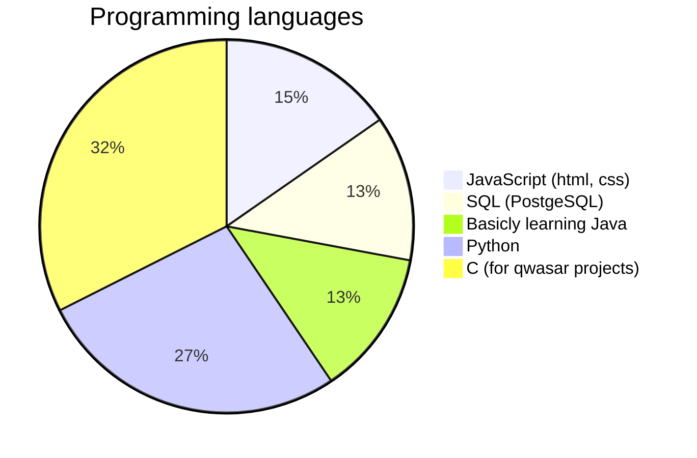

# Hi 👋, I’m Dilrabo 

- :earth_asia: I'm from Uzbekistan

- :information_desk_person: I'm student at [Qwasar Silicon Valley](https://qwasar.io/), 'FullStack Development' track
   
- :jigsaw: Languages: Uzbek, English(Intermediate), Russian

- :mountain_biking_man: My hobbies is Sport, watching Movies and Traveling

- :incoming_envelope: if you want [`my email`](mailto:dilraboxujamuratova@gmail.com)

## My case of using programming languages below

Contact:

[**` LinkedIn `**](https://www.linkedin.com/in/dilrabo-doniyorova-5796a4243/) **|**
[**` Telegram `**](https://t.me/Didi_Gold) **|**
[**`Telefon`**](tel:+998996066568)

<!---

Dilrabo1991/About-Me is a ✨ special ✨ repository because its `README.md` (this file) appears on your GitHub profile.
You can click the Preview link to take a look at your changes.
--->

<!--
**Dilrabo1991/Dilrabo1991** is a ✨ _special_ ✨ repository because its `README.md` (this file) appears on your GitHub profile.

Here are some ideas to get you started:

- 🔭 I’m currently working on ...
- 🌱 I’m currently learning ...
- 👯 I’m looking to collaborate on ...
- 🤔 I’m looking for help with ...
- 💬 Ask me about ...
- 📫 How to reach me: ...
- 😄 Pronouns: ...
- ⚡ Fun fact: ...
-->
